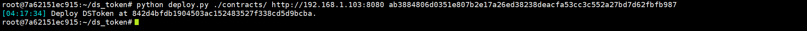

# Dstoken Test Scripts

- [Dstoken Test Scripts](#dstoken-test-scripts)
  - [1. Introduction](#1-introduction)
  - [2. Deploy the Contract](#2-deploy-the-contract)
    - [2.1. Mint Tokens](#21-mint-tokens)
    - [2.2. Transfer Tokens](#22-transfer-tokens)

## 1. Introduction

The dstoken was developed by MakerDAO and has been widely used in some popular applications like DAI. The version in the client docker has been optimized to allow concurrent execution.
Please replace the IP address `192.138.1.103` with your own node cluster IP.

## 2. Deploy the Contract

```sh
cd ds_token
python deploy.py ./contracts/ http://192.138.1.103:8080 ab3884806d0351e807b2e17a26ed38238deacfa53cc3c552a27bd7d62fbfb987
```



### 2.1. Mint Tokens

```sh
>python sendtxs.py http://192.138.1.103:8080 data/ds_token/ds_token_mint_200.out
```

### 2.2. Transfer Tokens

```sh
>python sendtxs.py http://192.138.1.103:8080 data/ds_token/ds_token__100.out
```